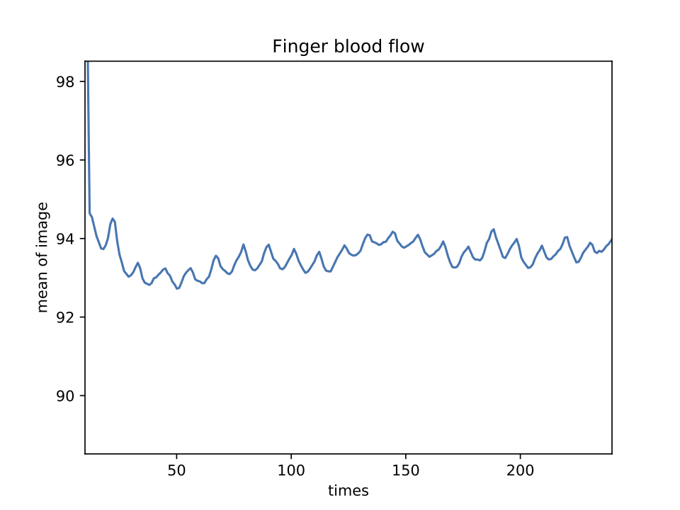

# ディジタル信号処理と画像処理　レポート課題

## B172170  北川大輝


- OpenCVを用いて，カメラ画像を取得し，毎フレームの輝度の平均値を出力，グラフにプロットするプログラムを作成する．

以下のソースコードのように実装した．

``` Python

%matplotlib nbagg

import numpy as np
import cv2
import matplotlib.pyplot as plt


y = [0] * 500
i = 0

cam = cv2.VideoCapture(0)
while True:
    _, img = cam.read()
    y[i] = img.mean()
    i += 1

    cv2.imshow('PUSH ENTER KEY', img)
    if cv2.waitKey(1) == 13: break

cam.release()
cv2.destroyAllWindows()

ave_y = sum(y[20: i-20]) / len(y[20:i-20])
x = np.linspace(0, 500, 500)
plt.plot(x, y)
plt.xlabel("times")
plt.ylabel("mean of image")
plt.xlim([10, i-10])
plt.ylim([ave_y-5, ave_y +5])
plt.title("Finger blood flow")
plt.savefig('Finger.pdf')
plt.show()

```
- コードの説明
    - インポートしたライブラリは，numpy，cv2，matplotlibの３種類
        - numpy ：array型の変数を使用するため．
        - cv2：openCVを使用するため．
        - matplotlib.pyplot：グラフを表示させるため．

    - `cam = cv2.VideoCapture(0)`：カメラのキャプチャ開始を表す．引数の０はカメラの番号を表す．

    - `cam.read()`：このメソッドにより，カメラから実際に画像を取得する．

    - `cv2.imshow('PUSH ENTER KEY', img)`：画像を出力ウィンドウに表示させるメソッド．

    - `cam.release(), cv2.destroyAllWindows()`：キャプチャを終了して，ウィンドウを閉じるためのメソッド．

    - Enterキーが押されると，カメラ画像からの映像の取得が終了する仕組みとなっている．

    - また，毎フレームの輝度値の平均値を格納する1次元配列y[]を500個宣言し，imgの値が更新されるたびに，mean()メソッドにより計算された輝度値の平均値を順に保存している．

    - グラフのプロットでは，横軸に計測したフレームの回数をとり，縦軸に輝度値の平均値をとった．

- 今回は，カメラに指を押し当てて，指を透過してレンズに届く光の僅かな変化をグラフにプロットした．そのグラフを以下に示す．
    - 脈拍に応じて，レンズまで届く光量に微妙な差が見られることが確認できる．



- 実行環境を以下に示す通りである．
    - macOS Mojave version 10.14.3
    - Python 3.7.3
    - openCV version 3.4.2

- 参考文献
    -
    -
    -
    -
    -
